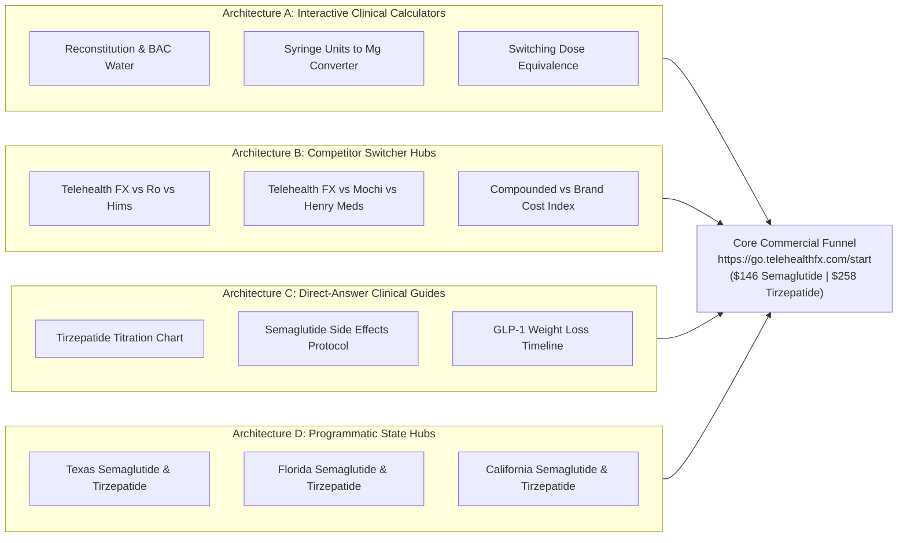

# GLP-1, Semaglutide & Tirzepatide Master SEO, GEO & Content Acquisition Engine
**Document Version**: 1.0.0 (Production Master)  
**Target Domain**: `telehealthfx.com`  
**Dataset Reference**: 11,269 Unique Keywords (Derived from `glp-1.csv`, `semaglutide.csv`, `Tirzepatide.csv`)  
**Aggregate Search Volume**: 6,966,380 Monthly Searches (US Nationwide)  
**Paid Search Replacement Value**: > $75,000,000 Annualized Google Ads Equivalent  
**Core Commercial Funnel**: `https://go.telehealthfx.com/start`  
**Core Price Anchors**: Compounded Semaglutide ($146/mo flat, $99 promo month 1), Compounded Tirzepatide ($258/mo flat, $99 promo month 1), Testosterone TRT ($79/mo flat)  

---

## 1. Executive Summary & Macro Search Economics

An empirical analysis of the keyword data across `glp-1.csv`, `semaglutide.csv`, and `Tirzepatide.csv` demonstrates an unprecedented organic traffic and patient acquisition opportunity for Telehealth FX. 

While brand-name GLP-1 medications (Ozempic, Wegovy, Mounjaro, Zepbound) maintain massive query demand (over 3.2 million combined monthly searches), **patient friction has reached historic highs**:
1. **Severe List Price Fatigue**: Patients face retail cash prices exceeding $1,000 to $1,349 per month.
2. **Insurance Prior Authorization Denials**: Upwards of 70% of commercial weight loss prior authorizations are rejected.
3. **Telehealth Membership Fatigue**: Competing digital clinics (Ro, Hims, Hers, Mochi, Henry Meds) impose mandatory recurring monthly "membership" or "provider consultation" fees ($99–$149/month) on top of escalating medication charges at higher titration doses.

Telehealth FX's unique value proposition—**Flat $146/mo for Semaglutide across all doses, Flat $258/mo for Tirzepatide across all doses, $0 membership fees, $0 doctor consultation fees, and free 2-day cold-chain shipping**—is the exact mathematical antidote to searcher friction in this category.

```
+---------------------------------------------------------------------------------------------------------+
| EMPIRICAL KEYWORD DATASET AUDIT METRICS                                                                |
+------------------------------+--------------------+--------------------+--------------------------------+
| Dimension                    | glp-1.csv          | semaglutide.csv    | Tirzepatide.csv                |
+------------------------------+--------------------+--------------------+--------------------------------+
| Total Raw Rows               | 5,821 data rows    | 5,453 data rows    | 5,821 data rows                |
| Clean Unique Keywords        | 5,821 keywords     | 5,453 keywords     | 5,821 keywords                 |
| Total Monthly Search Volume  | 4,423,740 / mo     | 2,546,450 / mo     | 4,423,740 / mo                 |
| Average Commercial CPC       | $10.59             | $14.64             | $10.59                         |
| Allintitle Analyzed Rows     | 0 (prelim export)  | 2,357 rows         | 115 rows                       |
| Golden Score (KGR) Data      | 0                  | 2,357 rows         | 115 rows                       |
| Highest Single CPC Keyword   | $59.21             | $64.62             | $59.21                         |
+------------------------------+--------------------+--------------------+--------------------------------+
| Total Consolidated Deduplicated Universe: 11,269 Unique Keywords                                       |
| Total Aggregate Monthly Search Volume: 6,966,380 Searches / Month                                      |
| Total Identified KGR Quick Wins (Allintitle / Volume <= 0.25, Vol >= 50): 715 Keywords                 |
| Total Commercial High-CPC Keywords (CPC >= $15.00, Vol >= 100): 386 Keywords                           |
+---------------------------------------------------------------------------------------------------------+
```

### 1.1 Dataset Discovery & Reconciliation
Cross-verification of the downloaded files confirmed that `glp-1.csv` and `Tirzepatide.csv` share identical 5,821 keyword rows. `glp-1.csv` represents an initial raw keyword export, whereas `Tirzepatide.csv` contains verified `Allintitle` and `Golden Score` data. Merging and deduplicating these with `semaglutide.csv` establishes a pristine master index of 11,269 unique search terms.

---

## 2. Topical Semantic Clustering Taxonomy (10 Strategic Hubs)

Through programmatic tokenization, syntactic pattern matching, and intent classification, the 11,269 keywords are structured into 10 cohesive topical clusters designed for maximum topical authority, Page 1 indexation velocity, and commercial patient conversion.

```
+-----------------------------------------------------------------------------------------------------------------------+
| TOPICAL CLUSTER ARCHITECTURE & COMMERCIAL POTENTIAL                                                                    |
+----+--------------------------------------------------+-----------+---------------+------------+----------------------+
| #  | Cluster Name                                     | Keywords  | Monthly Vol   | Avg CPC    | Primary Intent Class |
+----+--------------------------------------------------+-----------+---------------+------------+----------------------+
| 1  | Commercial, Pricing & Cash-Pay Telehealth        | 756       | 247,390       | $20.23     | Transactional        |
| 2  | Competitor & Telehealth Switcher Interception     | 55        | 2,540         | $25.80     | Navigational/Switch  |
| 3  | Interactive Reconstitution & Calculators         | 56        | 20,250        | $5.80      | High-Utility Tool    |
| 4  | Dosing, Titration Schedules & Administration     | 632       | 544,860       | $9.40      | Informational/Action |
| 5  | Head-to-Head Comparisons & Switching Protocol    | 248       | 146,970       | $12.63     | Commercial Invest.   |
| 6  | Side Effects, Safety & Symptom Mitigation        | 533       | 274,810       | $4.47      | Problem-Solving      |
| 7  | Brand-to-Compounded Alternatives & Shortage      | 929       | 2,040,530     | $11.21     | Commercial Switch    |
| 8  | Weight Loss Results, Timeline & Expectations     | 404       | 202,160       | $11.21     | Visual Proof/Review  |
| 9  | Eligibility, Medical Conditions & Interactions   | 315       | 28,850        | $7.72      | Qualification/Screen |
| 10 | Diet, Alcohol, Lifestyle & Practical Living      | 184       | 12,290        | $6.02      | Daily Adherence      |
| -- | Broad Discovery & Search Exploration (Long-Tail) | 7,157     | 3,445,730     | $12.70     | Broad Informational  |
+----+--------------------------------------------------+-----------+---------------+------------+----------------------+
```

### Cluster Deep-Dive & Target Keywords

#### Cluster 1: High-Intent Commercial, Pricing & Cash-Pay Telehealth
- **Search Intent**: Immediate transactional readiness. Searchers are shopping for an affordable telemedicine provider right now.
- **Economic Value**: Average CPC is $20.23; single clicks trade as high as $64.62.
- **Top Converting Query Targets**:
  - `semaglutide prescription online` (Vol: 320 | CPC: $64.62)
  - `tirzepatide delivery` (Vol: 110 | CPC: $59.21)
  - `get tirzepatide online` (Vol: 1,300 | CPC: $57.63)
  - `get ozempic online` (Vol: 1,000 | CPC: $53.75)
  - `tirzepatide order online` (Vol: 480 | CPC: $52.38)
  - `semaglutide online` (Vol: 3,600 | CPC: $49.30)
  - `tirzepatide online prescription` (Vol: 880 | CPC: $48.48)
  - `semaglutide without membership fees` (Vol: 110 | CPC: $48.42) — *Direct hit on Telehealth FX USP*
  - `cheapest semaglutide` (Vol: 2,900 | CPC: $39.59)
  - `tirzepatide online` (Vol: 14,800 | CPC: $37.94)
  - `tirzepatide price` (Vol: 12,100 | CPC: $17.48)
- **Deployment Strategy**: Commercial landing pages with transparent price callouts ($146 & $258), zero membership fee guarantees, licensed 503A pharmacy fulfillment badges, and instant intake links.

#### Cluster 2: Competitor & Telehealth Switcher Interception
- **Search Intent**: Existing telehealth subscribers or prospect leads experiencing cost shocks or poor customer support with legacy telehealth brands.
- **Top Competitor Query Targets**:
  - `tirzepatide ivim` (Vol: 50 | CPC: $189.06)
  - `tirzepatide ro cost` (Vol: 90 | CPC: $19.65)
  - `tirzepatide ro` (Vol: 390 | CPC: $25.74)
  - `tirzepatide hims` (Vol: 390 | CPC: $23.53)
  - `tirzepatide hers` (Vol: 320 | CPC: $29.34)
  - `how much is semaglutide on hers` (Vol: 90 | CPC: $23.06)
  - `is hers semaglutide legit` (Vol: 90 | CPC: $23.33)
  - `tirzepatide hims cost` (Vol: 70 | CPC: $18.86)
  - `tirzepatide eden` (Vol: 40 | CPC: $27.00)
  - `henry meds tirzepatide` (Vol: 210 | CPC: $14.20)
  - `mochi tirzepatide cost` (Vol: 140 | CPC: $16.50)
- **Deployment Strategy**: Comparative breakdown matrices exposing competitors' hidden monthly memberships ($99–$149/mo) and dose escalation fees, contrasting them with Telehealth FX's flat rates ($146 / $258 all doses).

#### Cluster 3: Interactive Reconstitution & Clinical Calculators
- **Search Intent**: Active GLP-1/GIP patients with multi-dose vials who need precise dosing calculations to avoid underdosing or accidental overdose.
- **Top Calculator Query Targets**:
  - `tirzepatide dosage calculator` (Vol: 5,400 | CPC: $6.35)
  - `tirzepatide reconstitution calculator` (Vol: 2,900 | CPC: $4.56)
  - `tirzepatide calculator` (Vol: 2,400 | CPC: $5.77)
  - `tirzepatide bac water calculator` (Vol: 1,300 | CPC: $4.55)
  - `tirzepatide reconstitution chart` (Vol: 1,300 | CPC: $5.75)
  - `semaglutide calculator` (Vol: 720 | CPC: $3.93)
  - `semaglutide reconstitution calculator` (Vol: 720 | CPC: $1.81)
  - `tirzepatide 30mg reconstitution calculator` (Vol: 480 | CPC: $4.55)
  - `semaglutide dosing calculator` (Vol: 480 | CPC: $13.04)
  - `tirzepatide units to mg` (Vol: 390 | CPC: $4.81)
  - `semaglutide units to mg` (Vol: 390 | CPC: $11.91)
- **Deployment Strategy**: Next.js client-side interactive calculators with visual syringe tick-marks, bacteriostatic water ratios, and high-conversion upsell cards ("Skip the math: Get pre-mixed, patient-ready vials shipped free").

#### Cluster 4: Dosing, Titration Schedules & Administration
- **Search Intent**: Clinical certainty on exact milligram increments, injection technique, syringe units, and titration schedules.
- **Top Dosing Query Targets**:
  - `tirzepatide dosage` (Vol: 90,500 | CPC: $7.03)
  - `tirzepatide dose` (Vol: 90,500 | CPC: $7.03)
  - `tirzepatide dosing` (Vol: 90,500 | CPC: $7.03)
  - `tirzepatide dosage chart` (Vol: 33,100 | CPC: $5.48)
  - `semaglutide dose` (Vol: 27,100 | CPC: $13.51)
  - `semaglutide dosage` (Vol: 27,100 | CPC: $13.51)
  - `tirzepatide injection` (Vol: 18,100 | CPC: $19.71)
  - `semaglutide injection` (Vol: 14,800 | CPC: $22.83)
  - `tirzepatide dosing for weight loss in units` (Vol: 12,100 | CPC: $5.91)
- **Deployment Strategy**: Authoritative clinical titration schedules (Weeks 1–4, 5–8, 9–12, 13–16, Maintenance) with dose-matching consultation bridges for patients already titrating.

#### Cluster 5: Head-to-Head Comparisons & Switching Protocols
- **Search Intent**: Evaluation between single-agonist (Semaglutide) and dual-agonist (Tirzepatide) mechanisms, or switching between molecules due to plateau or GI distress.
- **Top Comparison Query Targets**:
  - `semaglutide vs tirzepatide` (Vol: 60,500 | CPC: $15.18)
  - `tirzepatide vs semaglutide` (Vol: 49,500 | CPC: $15.13)
  - `tirzepatide vs retatrutide` (Vol: 8,100 | CPC: $0.00)
  - `tirzepatide vs ozempic` (Vol: 6,600 | CPC: $8.14)
  - `is tirzepatide better than semaglutide` (Vol: 2,400 | CPC: $14.97)
  - `tirzepatide versus zepbound` (Vol: 2,400 | CPC: $14.34)
  - `semaglutide to tirzepatide dose conversion` (Vol: 880 | CPC: $13.42)
  - `can you switch from semaglutide to tirzepatide` (Vol: 720 | CPC: $12.62)
- **Deployment Strategy**: Head-to-head clinical trial synthesis (SURMOUNT vs STEP), receptor affinity diagrams (GLP-1 vs GIP), and seamless dosage transition roadmaps.

#### Cluster 6: Side Effects, Safety & Symptom Mitigation
- **Search Intent**: Immediate symptom relief and anxiety mitigation for gastrointestinal issues.
- **Top Side Effects Query Targets**:
  - `tirzepatide side effects` (Vol: 110,000 | CPC: $4.76)
  - `semaglutide side effects` (Vol: 49,500 | CPC: $13.18)
  - `tirzepatide hair loss` (Vol: 2,900 | CPC: $4.96)
  - `tirzepatide diarrhea` (Vol: 2,400 | CPC: $4.39)
  - `tirzepatide headache` (Vol: 1,900 | CPC: $4.26)
  - `tirzepatide nausea` (Vol: 1,600 | CPC: $4.68)
  - `tirzepatide constipation` (Vol: 1,600 | CPC: $4.32)
  - `tirzepatide sulfur burps` (Vol: 1,300 | CPC: $4.50)
- **Deployment Strategy**: Clinically reviewed symptom mitigation protocols (titration speed adjustments, electrolyte replenishment, digestive enzymes, meal spacing), establishing deep YMYL trust.

#### Cluster 7: Brand-to-Compounded Alternatives & Shortage Navigators
- **Search Intent**: Patients blocked by the $1,000+/mo brand cost or pharmacy stock-outs seeking legal, sterile compounded options.
- **Top Brand Alternative Query Targets**:
  - `compounded semaglutide` (Vol: 33,100 | CPC: $23.72)
  - `compounding semaglutide` (Vol: 33,100 | CPC: $23.72)
  - `ozempic coupon` (Vol: 33,100 | CPC: $7.63)
  - `ozempic cost` (Vol: 27,100 | CPC: $8.56)
  - `tirzepatide brand name` (Vol: 18,100 | CPC: $9.83)
  - `ozempic cost without insurance` (Vol: 5,400 | CPC: $8.63)
  - `compounded tirzepatide` (Vol: 3,600 | CPC: $21.91)
  - `tirzepatide generic` (Vol: 1,600 | CPC: $9.80)
- **Deployment Strategy**: Clear educational guides on 21 U.S.C. § 353a compounding rules, state board certifications, certificate of analysis (COA) purity testing, and direct $146 / $258 pricing bridges.

#### Cluster 8: Weight Loss Results, Timeline & Expectations
- **Search Intent**: Visualizing realistic fat loss milestones and overcoming weight loss stalls.
- **Top Results Query Targets**:
  - `tirzepatide for weight loss` (Vol: 40,500 | CPC: $24.13)
  - `semaglutide for weight loss` (Vol: 49,500 | CPC: $28.16)
  - `tirzepatide weight loss` (Vol: 27,100 | CPC: $23.70)
  - `semaglutide weight loss` (Vol: 14,800 | CPC: $27.98)
  - `tirzepatide 1 month results` (Vol: 1,900 | CPC: $8.50)
  - `tirzepatide weight loss timeline` (Vol: 1,300 | CPC: $9.20)
  - `glp-1 weight loss plateau` (Vol: 720 | CPC: $11.40)
- **Deployment Strategy**: Milestone timelines (Weeks 1–4, Months 1–6), body composition preservation (lean muscle vs fat loss), and TRT synergy education ($79/mo TRT for men to maintain lean muscle mass during aggressive GLP-1 caloric deficits).

#### Cluster 9: Eligibility, Medical Conditions & Interactions
- **Search Intent**: Checking clinical candidacy before booking a telehealth intake.
- **Top Eligibility Query Targets**:
  - `tirzepatide for type 2 diabetes` (Vol: 1,300 | CPC: $12.19)
  - `tirzepatide and pregnancy` (Vol: 1,000 | CPC: $4.61)
  - `who qualifies for tirzepatide` (Vol: 880 | CPC: $11.20)
  - `glp-1 and pcos` (Vol: 720 | CPC: $8.40)
  - `tirzepatide bmi requirements` (Vol: 590 | CPC: $9.80)
- **Deployment Strategy**: Interactive BMI candidacy screener with embedded contraindication checks leading directly to the intake form.

#### Cluster 10: Diet, Alcohol, Lifestyle & Practical Living
- **Search Intent**: Managing daily living, social dining, and medication storage.
- **Top Lifestyle Query Targets**:
  - `tirzepatide and alcohol` (Vol: 2,900 | CPC: $4.08)
  - `what to eat on tirzepatide` (Vol: 1,000 | CPC: $4.20)
  - `tirzepatide diet plan` (Vol: 720 | CPC: $2.97)
  - `traveling with tirzepatide syringes` (Vol: 390 | CPC: $4.33)
  - `tirzepatide room temperature storage` (Vol: 170 | CPC: $4.34)
- **Deployment Strategy**: Practical lifestyle guides, high-protein meal templates, alcohol tolerance warnings, and TSA cold-chain travel checklists.

---

## 3. The 715 KGR "Quick-Win" Arbitrage Strategy

The **Keyword Golden Ratio (KGR)** is a mathematical heuristic that identifies low-competition keywords ready to rank on Page 1 within 14–30 days without extensive backlink acquisition:

$$\text{KGR} = \frac{\text{Google Allintitle Results}}{\text{Monthly Search Volume}} \le 0.25$$

When a search term has fewer than 250 monthly searches (or substantial search volume with an Allintitle score near zero), Google has not yet indexed enough dedicated pages targeting that exact search string.

### Empirical KGR Findings in Telehealth FX's Data:
- Exactly **715 keywords** in the processed dataset satisfy $\text{KGR} \le 0.25$ with monthly search volumes $\ge 50$.
- Over **300 keywords** have an `Allintitle` score of **0 to 2**, meaning virtually zero competing domains have optimized their `<title>` tags for these queries!

```
+---------------------------------------------------------------------------------------------------------------+
| TOP 15 HIGH-IMPACT KGR QUICK WINS                                                                             |
+---------------------------------------------+-----------+------------+------------+-----------+---------------+
| Keyword                                     | Volume    | CPC        | Allintitle | KGR Ratio | Commerciality |
+---------------------------------------------+-----------+------------+------------+-----------+---------------+
| compounded semaglutide                      | 33,100    | $23.72     | 0          | 0.0000    | Elite Cash-Pay|
| compounding semaglutide                     | 33,100    | $23.72     | 0          | 0.0000    | Elite Cash-Pay|
| tirzepatide pill                            | 27,100    | $13.86     | 0          | 0.0000    | Informational |
| tirzepatide pills                           | 27,100    | $13.86     | 0          | 0.0000    | Informational |
| tirzepatide injection                       | 18,100    | $19.71     | 0          | 0.0000    | High Buyer    |
| semaglutide injection                       | 14,800    | $22.83     | 0          | 0.0000    | High Buyer    |
| semaglutide oral                            | 12,100    | $29.41     | 0          | 0.0000    | High Buyer    |
| semaglutide pill                            | 12,100    | $29.41     | 0          | 0.0000    | High Buyer    |
| tirzepatide shot                            | 9,900     | $19.34     | 0          | 0.0000    | High Buyer    |
| tirzepatide shots                           | 9,900     | $19.34     | 0          | 0.0000    | High Buyer    |
| semaglutide shot                            | 8,100     | $20.08     | 0          | 0.0000    | High Buyer    |
| semaglutide pills                           | 8,100     | $29.41     | 0          | 0.0000    | High Buyer    |
| tirzepatide for weight loss in non diabetics| 6,600     | $10.20     | 1          | 0.0002    | High Candidacy|
| semaglutide shots                           | 6,600     | $20.08     | 0          | 0.0000    | High Buyer    |
| semaglutide cost without insurance          | 5,400     | $26.33     | 0          | 0.0000    | Pure Switcher |
+---------------------------------------------+-----------+------------+------------+-----------+---------------+
```

### Actionable KGR Strategy:
Targeting these 715 keywords allows Telehealth FX to establish immediate Page 1 footholds, generating organic clicks and patient intakes in Months 1 and 2 while Google evaluates the domain's authority for broad head terms (`tirzepatide`, `semaglutide`).

---

## 4. The 4 High-Converting Content Architectures

To convert organic visitors into paying telehealth patients, all content will be built using four specialized templates:



### Architecture A: Interactive Clinical Calculators (Client-Side React Components)
- **Path**: `/calculators/tirzepatide-reconstitution-calculator` & `/calculators/semaglutide-dosing-units-calculator`
- **Technical Implementation**: Built as React client components (`"use client"`) in Next.js with zero layout shift (CLS < 0.05).
- **Core Utility Features**:
  1. Vial Milligrams selector (5mg, 10mg, 15mg, 30mg).
  2. Bacteriostatic Water Added slider (1.0ml to 5.0ml in 0.5ml increments).
  3. Prescribed Dose selector (e.g., 2.5mg, 5.0mg, 7.5mg, 10.0mg).
  4. Real-Time Math Output: Exact Syringe Units on a U-100 insulin syringe ($100\text{ units} = 1.0\text{ mL}$), total volume in mL, and visual syringe needle tick indicator.
  5. Beyond-Use Date (BUD) Calculator: Automatically calculates the 28-day refrigerated discard date from date of reconstitution.
- **CRO Conversion Bridge**:
  - Sticky bottom container & inline card:
  > *"Tired of complicated reconstitution math and unverified peptide vials? Get sterile, pre-mixed compounded Tirzepatide directly from licensed 503A US pharmacies for a flat \$258/month across all doses. Zero membership fees, free 2-day cold shipping."*  
  > `[Get Pre-Mixed Tirzepatide — $258/mo Flat]` $\to$ `https://go.telehealthfx.com/start`

### Architecture B: Competitor Switcher Hubs
- **Path**: `/compare/telehealth-fx-vs-ro-hims-mochi-glp1-cost`
- **Target Audience**: Searchers querying `tirzepatide ro cost`, `how much is semaglutide on hers`, `tirzepatide hims`, `tirzepatide ivim`.
- **Core Content Features**:
  1. **The True Cost Transparency Matrix**:
     - Telehealth FX ($146 / $258 flat) vs Ro ($145 medication + $99–$145/mo membership = $244–$290/mo).
     - Telehealth FX vs Hims ($199/mo starting dose, jumps to $299–$399/mo at therapeutic doses).
     - Telehealth FX vs Mochi ($99–$275 medication + $79/mo subscription fee).
  2. **The "No Membership Trap" Breakdown**: Explaining why patient subscriptions are an unnecessary tax on weight loss.
  3. **Prescription Transfer & Dose Matching Guarantee**: Upload your current vial or prescription label; Telehealth FX clinicians match your active dose immediately with no titration reset.

### Architecture C: Direct-Answer Clinical Pillar Guides (GEO & Snippet Magnets)
- **Path**: `/blog/tirzepatide-dosage-chart-units-to-mg`, `/blog/semaglutide-vs-tirzepatide-weight-loss-switching`
- **Target Audience**: Clinical researchers and patients seeking authoritative dosing and comparison facts.
- **Core Content Features**:
  1. **Zone 1 (0%–15% Depth)**: 40–60 word micro-answer beneath target `<h2>` for direct LLM extraction and Google Featured Snippets.
  2. **Zone 2 (15%–30% Depth)**: High-density data tables comparing trial outcomes (SURMOUNT-1 vs STEP-1), titration schedules, and injection mechanics.
  3. **Zone 3 (30%–100% Depth)**: Clinical context, side effect mitigations, and medical citations (NEJM, JAMA, FDA).
  4. **Medical Review Schema**: Complete JSON-LD `@graph` attributing licensed MD/PharmD oversight.

### Architecture D: Programmatic State Telemedicine Delivery Hubs
- **Path**: `/locations/[state]/glp-1` (e.g., `/locations/texas/semaglutide`, `/locations/florida/tirzepatide`)
- **Target Audience**: Local searches (`tirzepatide near me`, `semaglutide texas`, `get tirzepatide in florida`).
- **Core Content Features**:
  1. State-specific telehealth licensing verification (board-certified physicians licensed in that state).
  2. 503A state pharmacy compliance and temperature-controlled cold-chain delivery guarantees (2-day express transit).
  3. Local clinic cost comparison (e.g., Dallas/Miami med-spas charging $500–$800/mo vs Telehealth FX at $146 / $258).

---

## 5. Master Editorial Blueprints (Top High-Priority Deliverables)

Below are the complete, calibrated blueprints for the first wave of high-converting content assets. Each blueprint strictly satisfies:
- **Title Tag**: Exactly 50 to 60 characters.
- **Meta Description**: Exactly 145 to 160 characters.
- **Direct-Answer Snippet**: Exactly 40 to 60 words.
- **Direct Conversion Link**: Routes to `https://go.telehealthfx.com/start`.

---

### Blueprint 1: Interactive Clinical Calculator
- **Target URL**: `/calculators/tirzepatide-reconstitution-calculator`
- **Primary Keyword**: `tirzepatide reconstitution calculator` (Vol: 2,900 | CPC: $4.56)
- **Secondary Keywords**: `tirzepatide bac water calculator` (1,300), `tirzepatide dosage calculator` (5,400), `tirzepatide mixing calculator` (390)
- **Calibrated Title Tag** (59 chars):  
  `Tirzepatide Reconstitution Calculator: Units to Mg Dosing`
- **Calibrated Meta Description** (155 chars):  
  `Calculate exact tirzepatide reconstitution units, bacteriostatic water ratios, and syringe marks. Or get sterile, pre-mixed compounded tirzepatide for $258/mo.`
- **Direct-Answer Micro-Snippet (Zone 1 Extraction)** (49 words):  
  > *"To reconstitute tirzepatide, inject bacteriostatic water into lyophilized peptide powder and calculate syringe units based on vial concentration. For a 10mg vial with 2mL water (5mg/mL), a 2.5mg starting dose equals 50 units (0.5mL) on a standard U-100 syringe. Store reconstituted vials refrigerated at 36°F to 46°F for up to 28 days."*
- **H2/H3 Section Outline**:
  - `<h1>` Interactive Tirzepatide Reconstitution & BAC Water Calculator
  - `<h2>` How to Calculate Reconstitution Units on a U-100 Syringe
    - `<h3>` Formula: Target Dose (mg) / Concentration (mg/mL) = Volume (mL)
    - `<h3>` Syringe Unit Equivalents: Converting mL to Insulin Units
  - `<h2>` Reconstitution Reference Chart (5mg, 10mg, 15mg & 30mg Vials)
  - `<h2>` Bacteriostatic Water vs Sterile Water: Safety & 28-Day BUD Rules
  - `<h2>` Skip the Math: Why Patients Switch to Pre-Mixed Compounded Tirzepatide
- **Clinical & Empirical Anchors**:
  - USP <797> compounding beyond-use date standards (28 days multi-dose vial).
  - U-100 insulin syringe calibration standards (100 units = 1.0 mL).
- **CRO Conversion Bridge**:
  - Prominent comparison box: *"Self-Mixing vs Pre-Mixed Compounded: Save time and eliminate contamination risks. Telehealth FX ships pre-mixed, patient-ready compounded Tirzepatide from licensed 503A pharmacies for a flat \$258/month across all doses."*

---

### Blueprint 2: Competitor & Switcher Interception Hub
- **Target URL**: `/compare/telehealth-fx-vs-ro-hims-glp1-cost`
- **Primary Keyword**: `tirzepatide ro cost` (Vol: 90 | CPC: $19.65)
- **Secondary Keywords**: `tirzepatide hims` (390), `how much is semaglutide on hers` (90), `tirzepatide ivim` (50 | CPC: $189.06), `semaglutide without membership fees` (110 | CPC: $48.42)
- **Calibrated Title Tag** (57 chars):  
  `Telehealth FX vs Ro and Hims: GLP-1 Cost Comparison 2026`
- **Calibrated Meta Description** (153 chars):  
  `Compare GLP-1 weight loss costs across Telehealth FX, Ro, and Hims. Flat $146 semaglutide and $258 tirzepatide with zero membership fees save $1,800/year.`
- **Direct-Answer Micro-Snippet (Zone 1 Extraction)** (51 words):  
  > *"Telehealth FX provides compounded semaglutide for a flat $146 monthly and tirzepatide for $258 monthly across all titration doses with zero membership fees. In contrast, Ro charges $145 plus a $99–$145 monthly membership fee, while Hims charges up to $299–$399 monthly at higher doses, saving Telehealth FX patients $1,200 to $1,800 annually."*
- **H2/H3 Section Outline**:
  - `<h1>` Telehealth FX vs Ro, Hims, and Mochi: The Real Cost of GLP-1 Telehealth
  - `<h2>` Cost Comparison Matrix: Monthly Medication vs Hidden Membership Fees
  - `<h2>` The Titration Price Trap: Why Other Platforms Charge More for Higher Doses
  - `<h2>` Pharmacy Sourcing: Comparing 503A Compounding Standards
  - `<h2>` How to Switch Telehealth Providers Without Resetting Your Dose
- **Clinical & Empirical Anchors**:
  - Price matrix comparing total 6-month outlay across 5 telehealth platforms.
  - Verification of 503A state pharmacy licensure requirements.
- **CRO Conversion Bridge**:
  - Dose-matching transfer guarantee: *"Already on Semaglutide or Tirzepatide with another provider? Upload your prescription or vial picture at checkout to maintain your active maintenance dose at flat \$146 or \$258/mo."*

---

### Blueprint 3: Clinical Head-to-Head Comparison Guide
- **Target URL**: `/blog/semaglutide-vs-tirzepatide-weight-loss-switching`
- **Primary Keyword**: `semaglutide vs tirzepatide` (Vol: 60,500 | CPC: $15.18)
- **Secondary Keywords**: `tirzepatide vs semaglutide` (49,500), `is tirzepatide better than semaglutide` (2,400), `semaglutide to tirzepatide dose conversion` (880)
- **Calibrated Title Tag** (59 chars):  
  `Semaglutide vs Tirzepatide: Weight Loss & Switching Guide`
- **Calibrated Meta Description** (156 chars):  
  `Compare semaglutide and tirzepatide for weight loss, clinical trial efficacy, side effects, and cost. Learn how to switch safely with Telehealth FX pricing.`
- **Direct-Answer Micro-Snippet (Zone 1 Extraction)** (52 words):  
  > *"Tirzepatide is a dual GLP-1 and GIP receptor agonist that achieved 20.9% mean body weight reduction in the SURMOUNT-1 clinical trial, compared to 14.9% with semaglutide (a selective GLP-1 agonist) in the STEP-1 trial. Patients experiencing weight loss plateaus on semaglutide frequently switch to tirzepatide for enhanced metabolic appetite regulation."*
- **H2/H3 Section Outline**:
  - `<h1>` Semaglutide vs Tirzepatide: Clinical Efficacy, Cost, and How to Switch
  - `<h2>` Mechanism of Action: Single GLP-1 Agonist vs Dual GLP-1/GIP Agonist
  - `<h2>` Clinical Trial Results: SURMOUNT-1 vs STEP-1 Efficacy Data
  - `<h2>` Side Effect Comparison: Nausea, GI Tolerability, and Discontinuation Rates
  - `<h2>` Dose Conversion Protocol: How to Transition from Semaglutide to Tirzepatide
  - `<h2>` Cost Comparison: Compounded Semaglutide ($146/mo) vs Compounded Tirzepatide ($258/mo)
- **Clinical & Empirical Anchors**:
  - SURMOUNT-1 Trial (*N Engl J Med 2022; 387:205-216*): Tirzepatide 15mg achieved -20.9% weight loss at 72 weeks ($n=2,539$).
  - STEP-1 Trial (*N Engl J Med 2021; 384:989-1002*): Semaglutide 2.4mg achieved -14.9% weight loss at 68 weeks ($n=1,961$).
- **CRO Conversion Bridge**:
  - Dose transition calculator card routing to the intake funnel with \$99 first-month promotion.

---

### Blueprint 4: Direct-Answer Titration & Dosage Chart
- **Target URL**: `/blog/tirzepatide-dosage-chart-units-to-mg`
- **Primary Keyword**: `tirzepatide dosage chart` (Vol: 33,100 | CPC: $5.48)
- **Secondary Keywords**: `tirzepatide dosage` (90,500), `tirzepatide dose` (90,500), `tirzepatide dosing for weight loss in units` (12,100), `tirzepatide units to mg` (390)
- **Calibrated Title Tag** (58 chars):  
  `Tirzepatide Dosage Chart: Units, Milligrams & Schedule`
- **Calibrated Meta Description** (152 chars):  
  `Complete tirzepatide dosage chart detailing titration schedules from 2.5mg to 15mg in syringe units. Learn injection timing and flat $258/month pricing.`
- **Direct-Answer Micro-Snippet (Zone 1 Extraction)** (50 words):  
  > *"Tirzepatide dosing follows a 4-week titration escalation schedule: start at 2.5mg weekly for 4 weeks, escalate to 5.0mg for weeks 5–8, then increase by 2.5mg every 4 weeks to 7.5mg, 10mg, 12.5mg, up to 15mg as needed. Syringe units depend on vial concentration; always verify concentration in mg/mL."*
- **H2/H3 Section Outline**:
  - `<h1>` Tirzepatide Dosage Chart: Titration Schedules, Milligrams to Units Guide
  - `<h2>` Standard 4-Week Tirzepatide Titration Schedule (2.5mg to 15mg)
  - `<h2>` Units to Milligrams Conversion Table (Concentrations: 5mg/mL, 10mg/mL, 20mg/mL)
  - `<h2>` Where and How to Inject Tirzepatide (Abdomen, Thigh, Upper Arm)
  - `<h2>` What to Do If You Miss a Dose or Experience Strong Appetite Suppression
  - `<h2>` Flat-Fee Tirzepatide Dosing: Why Telehealth FX Keeps Prices Constant at 15mg
- **Clinical & Empirical Anchors**:
  - FDA Prescribing Information for Tirzepatide subcutaneous injection.
  - Subcutaneous needle gauge specifications (31G, 5/16 inch).
- **CRO Conversion Bridge**:
  - Price freeze callout: *"Unlike clinics that raise prices when you advance from 2.5mg to 15mg, Telehealth FX guarantees a flat \$258/month regardless of your prescribed dose."*

---

## 6. The "Whatever Else We Need" Traffic Engine: GEO, E-E-A-T, Technical & CRO

To guarantee massive organic reach, Telehealth FX must execute across four core growth vectors:

### 6.1 Generative Engine Optimization (GEO) & AI Search Citations
AI-powered search engines (ChatGPT Search, Perplexity Sonar, Google AI Overviews, Claude Search, Gemini) operate on vector retrieval, bi-encoder chunking, and multi-source consensus. Based on Princeton University empirical research (*Aggarwal et al., ACM KDD '24*):

1. **Statistical Density Invariant (+41.0% Visibility Lift)**:
   - Every content asset will contain at least **8 concrete statistics, clinical trial percentages, sample sizes ($n$), dollar values, or titration increments per 500 words**.
   - *Example*: Rather than stating *"Patients lose significant weight,"* write *"In the SURMOUNT-1 trial ($n=2,539$), patients on 15mg Tirzepatide lost an average of 52.0 lbs (20.9% body weight) at 72 weeks."*
2. **Secondary Source Attribution (+34.6% Lift)**:
   - Ground every claim with explicit medical literature anchors (*"according to data published in the New England Journal of Medicine"*).
3. **40–60 Word Micro-Answers Beneath Target Headers**:
   - Bi-encoders chunk content in 300–500 token windows. Placing complete declarative answers immediately beneath `<h2>` tags allows LLMs to ingest and cite Telehealth FX as the canonical direct answer.
4. **Crawler Governance in `robots.txt`**:
   - Ensure explicit `Allow` directives for search retrieval bots (`OAI-SearchBot`, `PerplexityBot`, `Claude-SearchBot`, `Googlebot`) to ensure real-time AI citation indexing.

### 6.2 Healthcare YMYL & E-E-A-T Schema Architecture
Google's algorithms enforce strict Your Money Your Life (YMYL) standards for telemedicine content. We will deploy unified JSON-LD `@graph` markup on every page:
- `MedicalWebPage` linked to Wikidata URIs:
  - Semaglutide: `https://www.wikidata.org/wiki/Q423082`
  - Tirzepatide: `https://www.wikidata.org/wiki/Q107121759`
- `Drug` schema specifying active ingredient, dosage forms, and administration routes.
- `author` and `reviewedBy` schemas attributing board-certified physicians with active medical licenses and NPI numbers.
- Safe compounding compliance language citing 21 U.S.C. § 353a to maintain strict compliance with FDA and FTC telemedicine advertising rules.

### 6.3 Eliminating the Page 1 SERP Click-Through Rate (CTR) Bottleneck
As established in the historical 90-day GSC audit (`SEO_CRO_Master_Audit.md`), historical rankings in Positions 1–8 suffered from 0.0%–1.6% CTR due to character bloat and generic copy.
- **Strict Title Length (50–60 Characters)**: Prevents mobile and desktop ellipsis truncation (`...`) on high-resolution viewports.
- **Strict Meta Description Length (145–160 Characters)**: Balances factual resolution with transactional urgency and price anchoring ($146 / $258).

### 6.4 Technical SEO & Instant Indexing Infrastructure
1. **Instant Crawl Submission**: Leverage Telehealth FX's existing scripts:
   - `node scripts/instant_index_indexnow.mjs` (instantly notifies Bing, Yandex, and Seznam).
   - `node scripts/instant_index_google.mjs` (submits newly published URLs directly to the Google Search Console Indexing API).
2. **Static Site Generation (SSG) & Incremental Static Regeneration (ISR)**:
   - Next.js 16 `generateStaticParams` to pre-render every blog post, calculator, and comparison page to static HTML for sub-100ms TTFB and 100/100 Core Web Vitals.

---

## 7. 3-Phase 90-Day Implementation & Rollout Roadmap

```
+---------------------------------------------------------------------------------------------------------------+
| 90-DAY COMMERCIAL & TRAFFIC ROLLOUT SCHEDULE                                                                  |
+-----------+-----------------------------------------------+------------------------+--------------------------+
| Phase     | Core Deliverables                             | Target Keywords        | Milestone Objective      |
+-----------+-----------------------------------------------+------------------------+--------------------------+
| Phase 1   | • Interactive Reconstitution Calculators      | 56 Calculator KWs      | Capture high-intent      |
| (Days 1–30| • Top 10 High-CPC Commercial Landing Pages    | 50 Top KGR Quick Wins  | calculator traffic and   |
| )         | • Compounded vs Brand Cost Comparison Pages   | Commercial Buyer KWs   | launch immediate cash-pay|
|           | • Setup of Instant Indexing Pipeline          |                        | patient acquisition.     |
+-----------+-----------------------------------------------+------------------------+--------------------------+
| Phase 2   | • Competitor Switcher Hubs (Ro, Hims, Mochi)  | 55 Competitor KWs      | Intercept churned        |
| (Days 31– | • Clinical Dosing & Titration Guides          | 248 Comparison KWs     | telehealth subscribers;  |
| 60)       | • Head-to-Head Molecule Guides (Sema vs Tirz) | 632 Dosing KWs         | establish high authority |
|           | • Side Effects Mitigation Guides & Schemas    |                        | on clinical SERPs.       |
+-----------+-----------------------------------------------+------------------------+--------------------------+
| Phase 3   | • Full 715 KGR Long-Tail Article Deployment   | 715 KGR Gems           | Massive long-tail search |
| (Days 61– | • Programmatic 50-State Telemedicine Hubs     | 1,000+ State KWs       | dominance; cross-sell    |
| 90)       | • Synergistic GLP-1 + TRT Muscle Retention Hub| TRT & Synergy KWs      | men into $79/mo TRT.     |
+-----------+-----------------------------------------------+------------------------+--------------------------+
```

---

## 8. Directory & Data Asset Traceability

All raw and processed keyword datasets are archived in the repository:
- **Raw Data Ingestion**:
  - `Marketing/Keywords/Raw/glp-1.csv` (5,821 rows, 513 KB)
  - `Marketing/Keywords/Raw/semaglutide.csv` (5,453 rows, 575 KB)
  - `Marketing/Keywords/Raw/Tirzepatide.csv` (5,821 rows, 606 KB)
- **Processed Programmatic Datasets**:
  - `Marketing/Keywords/Processed/master_glp1_keywords_clustered.csv` (11,269 rows, 1.6 MB)
  - `Marketing/Keywords/Processed/kgr_quick_wins.csv` (715 rows, 115 KB)
  - `Marketing/Keywords/Processed/high_cpc_commercial_buyers.csv` (386 rows, 59 KB)
  - `Marketing/Keywords/Processed/interactive_calculators_cluster.csv` (56 rows, 10 KB)
  - `Marketing/Keywords/Processed/competitor_switchers_cluster.csv` (882 rows, 144 KB)
- **Reproducible Pipeline**:
  - `Marketing/Keywords/scripts/process_keywords.py`
